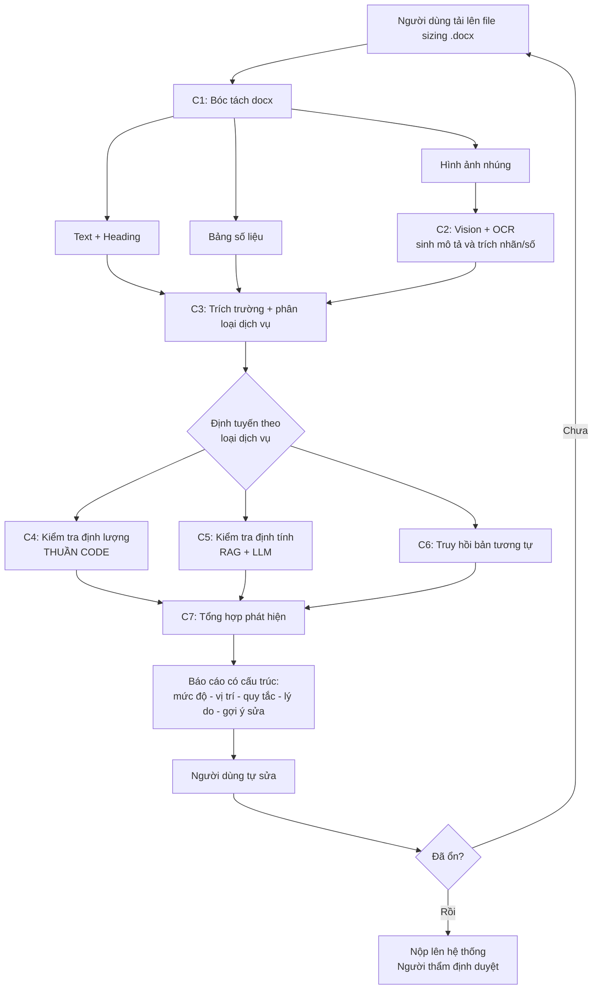

# KẾ HOẠCH TRIỂN KHAI: SIZING COPILOT
### Trợ lý AI hỗ trợ lập và tự kiểm bản định cỡ tài nguyên trước khi nộp

| | |
|---|---|
| **Phiên bản** | 1.0 (bản nháp để review nội bộ) |
| **Ngày lập** | 22/08/2026 |
| **Loại hệ thống** | Công cụ nội bộ — AI hỗ trợ (advisory), không tự ra quyết định |
| **Thời lượng dự kiến** | 8–10 tuần cho bản dùng thật; 2–3 tuần cho MVP |
| **Nguồn lực** | 01 người triển khai chính, sử dụng AI hỗ trợ viết mã |

---

## 1. BỐI CẢNH VÀ MỤC TIÊU

### 1.1. Hiện trạng

Đơn vị cấp phát tài nguyên (server, CPU, RAM, storage) tiếp nhận yêu cầu từ các đơn vị khác thông qua **bản sizing** — bảng định cỡ tài nguyên kèm sở cứ tính toán, soạn trên Word và nhập lên giao diện web sẵn có. Đơn vị thẩm định đối chiếu bản sizing với **bộ tài liệu định cỡ hệ thống** (quy tắc, công thức, ngưỡng), phản hồi yêu cầu chỉnh sửa, và quá trình này lặp lại nhiều vòng cho đến khi hai bên đồng thuận.

**Điểm nghẽn:** mỗi vòng phản hồi tốn thời gian của cả hai phía. Người làm sizing lần đầu thường mắc các lỗi cơ bản, lặp đi lặp lại, mà lẽ ra có thể tự phát hiện nếu nắm rõ bộ tiêu chí.

### 1.2. Mục tiêu

Xây dựng một **copilot đứng ở phía đơn vị xin tài nguyên**, chạy **trước khi nộp**, thực hiện:

1. Đọc bản sizing dạng Word, đối chiếu với bộ quy tắc định cỡ của đơn vị thẩm định.
2. Chỉ ra các điểm chưa đạt, kèm giải thích ngắn gọn và trích dẫn quy tắc làm căn cứ.
3. Gợi ý hướng sửa cụ thể để người viết chỉnh ngay, không phải chờ vòng phản hồi.
4. Với hệ thống tương tự bản đã ký trước đó: tìm bản gần nhất và đề xuất bản nháp đã điều chỉnh theo thông số mới.

### 1.3. Chỉ số thành công (đo sau 3 tháng vận hành)

| Chỉ số | Hiện trạng | Mục tiêu |
|---|---|---|
| Số vòng phản hồi trung bình / bản sizing | *(cần đo baseline)* | Giảm ≥ 40% |
| Tỷ lệ lỗi cơ bản còn sót khi nộp | *(cần đo baseline)* | Giảm ≥ 60% |
| Recall trên tập lỗi đã biết (eval set) | — | ≥ 70% |
| Tỷ lệ cảnh báo sai (false positive) | — | ≤ 20% |
| Tỷ lệ người dùng sử dụng trước khi nộp | 0% | ≥ 70% |

> **Lưu ý:** cần đo baseline hai chỉ số đầu **ngay ở Giai đoạn 0**, trước khi triển khai. Không có baseline thì sau này không chứng minh được giá trị của hệ thống.

### 1.4. Phạm vi

**Trong phạm vi:**
- Rà soát bản sizing dạng `.docx` (text, bảng, hình ảnh nhúng).
- Kiểm tra quy tắc định lượng (công thức, ngưỡng, tính nhất quán số liệu) và định tính (đủ mục, đủ sở cứ).
- Truy hồi bản sizing tương tự và đề xuất scale thông số.
- Xuất báo cáo phát hiện có cấu trúc, phân mức ưu tiên.

**Ngoài phạm vi (giai đoạn này):**
- Tự động phê duyệt / từ chối bản sizing. **Người thẩm định vẫn là người quyết định cuối cùng.**
- Tự động sửa và ghi đè file Word của người dùng.
- Thay thế bộ tài liệu tiêu chí hoặc tự sinh quy tắc mới.
- Dự báo tăng trưởng tài nguyên dài hạn, tối ưu chi phí hạ tầng.
- Trợ lý soạn thảo trực tiếp trong Word (add-in), hoặc thay thế luồng nhập liệu
  của web app hiện hành.

#### Hỗ trợ khâu tạo đến đâu

Câu hỏi hay gặp: *"công cụ có đỡ tôi ngay lúc đang viết không, hay chỉ chấm điểm
sau khi viết xong?"* Trả lời thẳng: **Copilot là bước kiểm trước khi nộp, không
phải trợ lý soạn thảo từng bước.** Đây là lựa chọn có chủ ý, vì ba lý do:

1. **Người dùng soạn trên Word** — môi trường Copilot không can thiệp vào được.
   Muốn đỡ từng bước thì phải làm add-in Word hoặc bắt người dùng đổi cách soạn.
   Cả hai đều vượt xa phạm vi và mâu thuẫn với gạch đầu dòng "không tự sửa và ghi
   đè file Word" ở trên.
2. **Phần hỗ trợ khâu tạo thật sự nằm ở C6** — tìm bản đã ký gần nhất và sinh bản
   nháp đã scale theo thông số mới (Giai đoạn 2, mục 2.6–2.9). Đây mới là thứ giúp
   người viết có điểm khởi đầu, thay vì bắt đầu từ trang trắng.
3. **Trước khi có C6, cách rẻ nhất để đỡ người tạo không phải là AI:** một mẫu Word
   chuẩn có sẵn các mục bắt buộc (mục 1.16), cộng với việc chạy kiểm **nhiều lần
   trên bản nháp** thay vì một lần lúc sắp nộp (mục 2.14). Hai việc này không cần
   mô hình nào cả.

> Lưu ý cho người đọc sau: hệ thống web hiện hành đã có luồng tạo sizing từng bước
> (5 tab) và tự sinh `.docx` từ dữ liệu có cấu trúc. Điều đó gợi ý phương án kiểm
> thẳng trên dữ liệu JSON thay vì đọc ngược file Word. Phương án đó **đã được cân
> nhắc và bác bỏ** — lý do ghi trong Nhật ký quyết định ở `PLAN.md` (2026-08-24).
> Đừng đặt lại câu hỏi này nếu không có dữ kiện mới.

---

## 2. NGUYÊN TẮC THIẾT KẾ

Bốn nguyên tắc sau chi phối toàn bộ kiến trúc. Vi phạm một trong số đó là nguyên nhân phổ biến nhất khiến các dự án cùng dạng thất bại.

**NT1 — Tính toán bằng code, không bằng LLM.**
LLM chỉ làm nhiệm vụ *trích xuất* con số từ tài liệu. Mọi phép tính, so sánh ngưỡng, kiểm tra nhất quán đều do code Python thực hiện. LLM tính số học không đáng tin và sai lệch không theo quy luật, rất khó phát hiện.

**NT2 — Mọi nhận xét phải có căn cứ (grounding).**
Mỗi phát hiện bắt buộc neo vào một trong hai thứ: (a) mã quy tắc trong bộ tiêu chí kèm trích dẫn, hoặc (b) một phép tính do code thực hiện với số liệu hiển thị được. Không có căn cứ thì không xuất ra. Đây là cơ chế chống bịa đặt hiệu quả nhất.

**NT3 — Quy tắc là dữ liệu, không phải là prompt.**
Bộ quy tắc lưu trong file cấu hình có cấu trúc, tách khỏi mã nguồn và tách khỏi prompt. Khi tài liệu tiêu chí thay đổi, người nghiệp vụ sửa file cấu hình mà không cần lập trình viên.

**NT4 — Xuống cấp có kiểm soát (graceful degradation).**
Khi hệ thống không chắc chắn (điển hình là với hình ảnh, sơ đồ), nó phải **nói rõ là không kiểm chứng được** và đề nghị người dùng bổ sung, thay vì im lặng bỏ qua hoặc phán đoán liều. Một cảnh báo trung thực có giá trị hơn một kết luận sai.

---

## 3. KIẾN TRÚC TỔNG THỂ

### 3.1. Sơ đồ phân lớp

```
┌──────────────────────────────────────────────────────────────────────┐
│  LỚP GIAO DIỆN                                                       │
│  • Web nội bộ sẵn có (thêm nút "Kiểm tra sizing")                    │
│  • Giao diện thử nghiệm Streamlit (dùng ở GĐ 1–2)                    │
└───────────────────────────────┬──────────────────────────────────────┘
                                │ REST API (FastAPI)
┌───────────────────────────────▼──────────────────────────────────────┐
│  LỚP ĐIỀU PHỐI (Orchestration)                                       │
│  Pipeline có kiểm soát: Ingest → Extract → Validate → Report         │
└───┬──────────┬──────────┬──────────┬──────────┬──────────┬───────────┘
    │          │          │          │          │          │
┌───▼────┐ ┌───▼────┐ ┌───▼────┐ ┌───▼────┐ ┌───▼────┐ ┌───▼─────┐
│ C1     │ │ C2     │ │ C3     │ │ C4     │ │ C5     │ │ C6      │
│ Bóc    │ │ Xử lý  │ │ Trích  │ │ Kiểm   │ │ Kiểm   │ │ Truy hồi│
│ tách   │ │ hình   │ │ trường │ │ tra    │ │ tra    │ │ bản     │
│ docx   │ │ ảnh    │ │ + phân │ │ định   │ │ định   │ │ tương tự│
│        │ │        │ │ loại   │ │ lượng  │ │ tính   │ │ + scale │
└────────┘ └───┬────┘ └───┬────┘ └───┬────┘ └───┬────┘ └───┬─────┘
               │          │          │          │          │
┌──────────────▼──────────▼──────────▼──────────▼──────────▼──────────┐
│  LỚP TỔNG HỢP (C7) — gom, khử trùng lặp, xếp ưu tiên, sinh giải thích│
└───────────────────────────────┬──────────────────────────────────────┘
                                │
┌───────────────────────────────▼──────────────────────────────────────┐
│  LỚP TRI THỨC & HẠ TẦNG                                              │
│  • Kho quy tắc (YAML)   • Vector DB (Qdrant)   • Kho bản sizing cũ   │
│  • LLM self-hosted qua vLLM (chat / vision / embedding)              │
└──────────────────────────────────────────────────────────────────────┘
```

### 3.2. Luồng hoạt động chính



---

## 4. CHI TIẾT CÁC THÀNH PHẦN

### C1 — Bóc tách tài liệu (Document Ingestion)

**Nhiệm vụ:** đọc file `.docx`, tách thành ba dòng nội dung riêng biệt: văn bản có cấu trúc phân cấp, bảng số liệu, và hình ảnh kèm ngữ cảnh xung quanh.

**Công nghệ:** `python-docx` (text và bảng), `docx2python` (giữ cấu trúc lồng nhau tốt hơn khi bảng phức tạp), giải nén trực tiếp file `.docx` bằng `zipfile` để lấy ảnh trong `word/media/`.

**Chi tiết cần lưu ý:**
- Giữ **vị trí** của mọi phần tử (số thứ tự đoạn, tên heading cha) để báo cáo chỉ đúng chỗ cần sửa.
- Với mỗi ảnh, lưu kèm **đoạn văn liền trước và liền sau** làm ngữ cảnh — đây là thông tin quyết định chất lượng của C2.
- Chuẩn hóa số liệu ngay tại đây: `1.000` / `1,000` / `1000`, `GB` / `Gb` / `G`, `2 vCPU` / `2 core`. Đây là nguồn lỗi âm thầm rất lớn nếu bỏ qua.

**Đầu ra:** một đối tượng `SizingDocument` gồm danh sách block (text/table/image) có định danh vị trí.

---

### C2 — Xử lý hình ảnh (Multimodal Understanding)

**Nhiệm vụ:** sinh mô tả text cho từng ảnh và trích các nhãn/con số nhìn thấy được, để nội dung ảnh tham gia được vào bước kiểm tra.

**Công nghệ:** model đa phương thức tự host qua vLLM (cần xác nhận model nào trong cụm hỗ trợ vision); bổ sung OCR offline bằng PaddleOCR hoặc Tesseract cho phần chữ nhỏ trong ảnh chụp màn hình.

**Đây là mắt xích yếu nhất của hệ thống.** Sở cứ được cung cấp dưới rất nhiều dạng không cố định: sơ đồ kiến trúc, biểu đồ tải, ảnh chụp dashboard. Không nên kỳ vọng AI "hiểu" trọn vẹn một sơ đồ kiến trúc.

**Cách xử lý thực dụng — phân loại ảnh rồi ứng xử khác nhau:**

| Loại ảnh | Mức độ khai thác | Cách ứng xử |
|---|---|---|
| Ảnh chụp dashboard/biểu đồ tải có số | Cao — OCR lấy được số | Đưa số vào C4 để đối chiếu với bảng sizing |
| Sơ đồ kiến trúc | Thấp — chỉ nhận diện có/không | Kiểm tra sự **tồn tại** và **được tham chiếu** trong văn bản; cảnh báo nếu thiếu nhãn |
| Ảnh mờ / không rõ loại | Không khai thác | Cảnh báo "không kiểm chứng được, đề nghị bổ sung dạng số/bảng" |

**Nguyên tắc bắt buộc (theo NT4):** khi không chắc, ghi rõ giới hạn. Ví dụ đầu ra đúng chuẩn:
> *"Phát hiện có sơ đồ tại mục 3.2 nhưng không xác nhận được sơ đồ này thể hiện cơ chế replication của cơ sở dữ liệu. Đề nghị ghi nhãn rõ node master/replica hoặc mô tả bằng văn bản kèm theo."*

---

### C3 — Trích trường và phân loại dịch vụ (Structured Extraction)

**Nhiệm vụ:** chuyển tài liệu tự do thành cấu trúc dữ liệu chuẩn, đồng thời nhận diện loại hình hệ thống để định tuyến sang đúng bộ quy tắc.

**Công nghệ:** LLM chat qua API tương thích OpenAI của vLLM, bắt buộc dùng **structured output theo JSON Schema** kết hợp `pydantic` để ràng buộc kiểu dữ liệu.

**Thiết kế schema — quan trọng:** dùng mô hình **lõi + mở rộng** để xử lý yêu cầu "trường linh hoạt tùy loại dịch vụ" đã nêu.

```python
class SizingCore(BaseModel):
    service_name: str
    service_type: Literal["app", "database", "cache", "queue", "storage", "other"]
    concurrent_users: int | None
    qps: float | None
    peak_factor: float | None          # hệ số đỉnh so với trung bình
    growth_rate_yearly: float | None
    retention_months: int | None
    ha_model: str | None               # active-active, active-passive, standalone
    resources: list[ResourceLine]      # từng node: vCPU, RAM, disk, số lượng
    evidence_refs: list[EvidenceRef]   # trỏ tới vị trí sở cứ trong tài liệu

class SizingExtension(BaseModel):
    service_type: str
    fields: dict[str, Any]             # trường riêng theo loại dịch vụ
```

**Xử lý trường thiếu:** không được để LLM tự điền giá trị mặc định. Thiếu thì để `None` và đánh dấu là một phát hiện thuộc nhóm "thiếu thông tin". Đây là lỗi thiết kế rất hay gặp và làm hỏng toàn bộ độ tin cậy phía sau.

**Cơ chế tự kiểm:** mỗi trường trích ra phải kèm **đoạn văn gốc** (span) để C7 hiển thị và người dùng đối chiếu nhanh.

---

### C4 — Kiểm tra định lượng (Rules-as-Code) ⭐

**Đây là thành phần tạo ra giá trị lớn nhất và có độ tin cậy cao nhất.**

**Nhiệm vụ:** thực thi các quy tắc tính được bằng code Python thuần, không qua LLM.

**Ba nhóm kiểm tra:**

1. **Kiểm tra công thức:** tính lại theo công thức chuẩn rồi so với con số người dùng ghi.
   Ví dụ: `storage_required = data_volume × replication_factor × (1 + growth_rate)^years × (1 + overhead)`
2. **Kiểm tra ngưỡng:** đối chiếu với ngưỡng cho phép (tỷ lệ CPU:RAM, dung lượng tối đa mỗi node, mức dự phòng tối thiểu).
3. **Kiểm tra nhất quán nội bộ:** các con số trong tài liệu có mâu thuẫn nhau không (tổng tài nguyên các node ≠ tổng ghi ở phần kết luận; QPS khai báo không tương thích với số user đồng thời và think-time).

**Công nghệ:** Python + `pydantic`; quy tắc định nghĩa trong YAML (xem Phụ lục A); biểu thức công thức tính an toàn bằng `asteval` hoặc `simpleeval` (**không dùng `eval()` trực tiếp**).

**Ví dụ một phát hiện do C4 sinh ra:**
> **[NGHIÊM TRỌNG]** Mục 4.1 — Dung lượng storage khai báo 2.000 GB. Theo công thức STO-01 với dữ liệu gốc 500 GB, replication ×3, tăng trưởng 30%/năm trong 3 năm, overhead 20%: kết quả tính lại là **3.953 GB**. Chênh lệch 49%. Đề nghị rà soát lại tham số hoặc bổ sung giải thích nếu cố ý giảm.

---

### C5 — Kiểm tra định tính (RAG + LLM Reasoning)

**Nhiệm vụ:** xử lý các yêu cầu không quy về công thức được — đủ mục bắt buộc chưa, sở cứ có thuyết phục không, lập luận có mâu thuẫn không, đã xét đến kịch bản sự cố chưa.

**Công nghệ:** embedding model đa ngữ mạnh tiếng Việt (**BGE-M3** là lựa chọn phù hợp) serve qua vLLM hoặc text-embeddings-inference; vector DB **Qdrant** (hoặc Chroma nếu muốn nhẹ hơn); LLM chat cho bước suy luận.

**Luồng:** với mỗi mục cần thẩm định → truy hồi 3–5 đoạn quy tắc liên quan từ tài liệu tiêu chí → đưa kèm nội dung tương ứng của bản sizing vào prompt → yêu cầu LLM trả về JSON gồm `đạt/không đạt`, `lý do`, và **`trích dẫn quy tắc`**.

**Ràng buộc bắt buộc:** prompt phải nêu rõ *"chỉ đánh giá dựa trên các quy tắc được cung cấp; nếu không có quy tắc nào liên quan, trả về `không áp dụng`"*. Không có ràng buộc này, mô hình sẽ tự chế ra tiêu chuẩn theo hiểu biết chung — nguồn gốc phổ biến nhất của kết quả thiếu nhất quán.

---

### C6 — Truy hồi bản tương tự và đề xuất scale

**Nhiệm vụ:** hiện thực hóa cách làm việc thực tế đã có — tái sử dụng bản sizing đã ký cho hệ thống tương tự rồi điều chỉnh thông số.

**Luồng:**
1. Sinh embedding cho mô tả hệ thống mới, tìm top-3 bản sizing đã ký gần nhất (lọc trước theo `service_type`).
2. Hiển thị bản gần nhất kèm **độ tương đồng** và **điểm khác biệt chính** so với hệ thống mới.
3. Tính hệ số scale theo driver (ví dụ số user tăng 3 lần) và sinh **bản nháp đã điều chỉnh**.

**Cảnh báo phi tuyến — bắt buộc phải có:** không phải mọi thông số đều scale tuyến tính. Hệ thống phải đánh dấu rõ những tham số cần người xem lại:

| Loại tham số | Hành vi khi scale | Ứng xử của hệ thống |
|---|---|---|
| Storage theo khối lượng dữ liệu | Thường tuyến tính theo dữ liệu, **không phải theo số user** | Scale nhưng cảnh báo kiểm tra lại driver |
| RAM ứng dụng | Có phần hằng số (OS, JVM base) + phần biến thiên | Chỉ scale phần biến thiên |
| vCPU theo QPS | Có thể phi tuyến khi tới ngưỡng bão hòa | Scale tuyến tính + gắn cờ "cần kiểm chứng bằng benchmark" |
| Số node HA | Bậc thang, không liên tục | Làm tròn lên + nêu rõ đã làm tròn |

Thông điệp gửi người dùng phải rõ: đây là **điểm khởi đầu để chỉnh**, không phải kết quả cuối cùng.

---

### C7 — Tổng hợp và sinh báo cáo

**Nhiệm vụ:** gom phát hiện từ C2/C4/C5/C6, khử trùng lặp, xếp ưu tiên, diễn đạt lại ngắn gọn dễ hiểu cho người mới.

**Cấu trúc mỗi phát hiện:**

```json
{
  "id": "F-012",
  "severity": "critical | major | minor | info",
  "category": "thiếu thông tin | sai công thức | vượt ngưỡng | mâu thuẫn | thiếu sở cứ | không kiểm chứng được",
  "location": "Mục 4.1 – Bảng dung lượng lưu trữ",
  "rule_ref": "STO-01",
  "rule_quote": "<trích dẫn nguyên văn quy tắc>",
  "finding": "<mô tả ngắn, 1–2 câu>",
  "computed_evidence": { "expected": 3953, "declared": 2000, "unit": "GB" },
  "suggestion": "<gợi ý sửa cụ thể>",
  "confidence": "high | medium | low"
}
```

**Phân mức ưu tiên:**
- **Critical** — chắc chắn bị trả lại: thiếu mục bắt buộc, sai công thức bắt buộc, vượt ngưỡng cứng.
- **Major** — nhiều khả năng bị hỏi lại: thiếu sở cứ, số liệu mâu thuẫn.
- **Minor** — nên sửa cho hoàn thiện: trình bày, đơn vị, làm tròn.
- **Info** — điểm hệ thống không kiểm chứng được, người dùng tự xác nhận.

**Định dạng đầu ra:** JSON cho web tiêu thụ, kèm bản Markdown/HTML để người dùng đọc và một checklist rút gọn để đối chiếu nhanh.

---

### 4.8. Bảng tổng hợp công nghệ

| Thành phần | Công nghệ chính | Ghi chú lựa chọn |
|---|---|---|
| Ngôn ngữ | Python 3.11+ | Hệ sinh thái đầy đủ nhất |
| Điều phối | Python thuần (GĐ 1) → LangGraph (GĐ 2 nếu cần) | Giữ mỏng, ưu tiên dễ debug |
| API service | FastAPI + Uvicorn | Web sẵn có gọi vào qua REST |
| Đọc Word | python-docx, docx2python, zipfile | Kết hợp để phủ hết text/bảng/ảnh |
| OCR | PaddleOCR hoặc Tesseract | Chạy offline, không phụ thuộc mạng ngoài |
| Gọi LLM | `openai` SDK trỏ vào `base_url` của vLLM | vLLM expose sẵn OpenAI-compatible API |
| Ràng buộc đầu ra | Pydantic + JSON Schema (guided decoding của vLLM) | Bắt buộc để trích trường ổn định |
| Embedding | BGE-M3 (đa ngữ, mạnh tiếng Việt) | Cần xác nhận cụm đã host chưa; nếu chưa phải bổ sung |
| Vector DB | Qdrant (hoặc Chroma) | Chạy on-prem, đơn giản |
| Quy tắc | YAML + asteval/simpleeval | Người nghiệp vụ sửa được, không cần lập trình |
| Giao diện thử | Streamlit | Dựng nhanh, dùng nội bộ GĐ 1–2 |
| Kiểm thử | pytest + eval harness tự viết | Chạy lại toàn bộ eval set mỗi lần đổi prompt |
| Quản lý mã | Git + uv (hoặc poetry) | |
| Triển khai | Docker Compose | |

> **Cần xác minh trước khi bắt đầu:** cụm LLM hiện tại có model nào hỗ trợ **vision**, có endpoint **embedding** chưa, giới hạn context window và rate limit của API key được cấp. Ba thông tin này ảnh hưởng trực tiếp đến thiết kế C2, C5, C6.

---

## 5. KẾ HOẠCH TRIỂN KHAI THEO GIAI ĐOẠN

### Tổng quan tiến độ

| GĐ | Tên | Thời lượng | Kết quả bàn giao |
|---|---|---|---|
| 0 | Chuẩn bị tri thức và dữ liệu | 1–1.5 tuần | Bộ quy tắc số hóa + eval set + baseline |
| 1 | MVP chỉ xử lý text | 2–3 tuần | Công cụ chạy được, sinh báo cáo phát hiện |
| 2 | Đa phương thức + tái sử dụng | 2–3 tuần | Xử lý ảnh + truy hồi/scale bản cũ |
| 3 | Tích hợp và tinh chỉnh | 2 tuần | Tích hợp web nội bộ, đạt ngưỡng chất lượng |
| 4 | Vận hành và cải tiến | Liên tục | Quy trình cập nhật quy tắc, theo dõi chỉ số |

---

### GIAI ĐOẠN 0 — CHUẨN BỊ TRI THỨC VÀ DỮ LIỆU
**Thời lượng: 1–1.5 tuần**

> **Đây là giai đoạn quyết định trần chất lượng của toàn bộ hệ thống.** Công sức lớn nhất không nằm ở viết code — phần đó AI hỗ trợ được — mà nằm ở hai việc thủ công dưới đây, đòi hỏi chuyên môn của đơn vị và không giao cho AI làm thay được. Bỏ qua hoặc làm ẩu giai đoạn này thì mọi giai đoạn sau đều vô nghĩa.

**Công việc:**

- [ ] **0.1.** Rà soát toàn bộ tài liệu định cỡ hệ thống, liệt kê mọi quy tắc thành danh sách phẳng.
- [ ] **0.2.** Phân loại mỗi quy tắc thành **định lượng** (tính được bằng công thức → C4) hoặc **định tính** (cần phán đoán → C5). Ghi nhận tỷ lệ hai nhóm.
- [ ] **0.3.** Với nhóm định lượng: viết rõ công thức, tham số đầu vào, ngưỡng, và **đơn vị**. Đây là phần tạo giá trị cao nhất.
- [ ] **0.4.** Với nhóm định tính: viết tiêu chí "thế nào là đạt" bằng ngôn ngữ cụ thể, tránh chung chung.
- [ ] **0.5.** Số hóa thành file `rules.yaml` theo cấu trúc ở Phụ lục A. Mỗi quy tắc có mã định danh (`STO-01`, `CPU-03`...).
- [ ] **0.6.** Chuẩn hóa 30 bản sizing lịch sử: đặt tên thống nhất, ghi metadata (loại dịch vụ, ngày, trạng thái).
- [ ] **0.7.** Với mỗi bản lịch sử, ghi lại **các lỗi mà người thẩm định đã bắt** → đây chính là **eval set** (nhãn vàng).
- [ ] **0.8.** Chia dữ liệu: ~20 bản làm tập phát triển, ~10 bản làm **tập kiểm tra giữ kín** (không được dùng để chỉnh prompt).
- [ ] **0.9.** **Đo baseline:** số vòng phản hồi trung bình và thời gian trung bình mỗi vòng hiện nay.
- [ ] **0.10.** Xác minh hạ tầng: model vision, endpoint embedding, context window, rate limit.

**Đầu ra:** `rules.yaml` (≥ 80% quy tắc trong tài liệu đã số hóa); thư mục `data/historical/` gồm 30 bản; `data/eval_set.json`; báo cáo baseline một trang.

**Tiêu chí hoàn thành:** một người thứ hai trong đơn vị đọc `rules.yaml` và xác nhận nó phản ánh đúng tài liệu gốc.

**Rủi ro:** phát hiện tài liệu tiêu chí có chỗ mơ hồ hoặc mâu thuẫn. *Đây là kết quả tốt, không phải trở ngại* — ghi nhận lại và thống nhất với người thẩm định. Việc số hóa quy tắc thường tự nó đã mang lại giá trị cho đơn vị, độc lập với phần AI.

---

### GIAI ĐOẠN 1 — MVP CHỈ XỬ LÝ TEXT
**Thời lượng: 2–3 tuần**

**Mục tiêu:** có công cụ chạy được đầu-cuối trên nội dung text và bảng, **tạm bỏ qua hoàn toàn hình ảnh**. Chứng minh giá trị sớm trước khi đầu tư vào phần khó.

**Tuần 1 — Nền tảng và bóc tách**

- [ ] **1.1.** Khởi tạo dự án, cấu trúc thư mục (Phụ lục B), Git, môi trường ảo.
- [ ] **1.2.** Kết nối thử LLM qua vLLM: gọi chat, kiểm tra structured output hoạt động.
- [ ] **1.3.** Xây C1 — đọc `.docx`: text, heading, bảng, giữ vị trí.
- [ ] **1.4.** Module chuẩn hóa đơn vị và số liệu (bộ test riêng cho module này).
- [ ] **1.5.** Chạy C1 trên cả 30 bản lịch sử, ghi nhận trường hợp lỗi định dạng.

**Tuần 2 — Trích xuất và kiểm tra định lượng**

- [ ] **1.6.** Định nghĩa schema Pydantic (`SizingCore` + `SizingExtension`).
- [ ] **1.7.** Xây C3 — trích trường bằng LLM có structured output; đo độ chính xác trên tập phát triển.
- [ ] **1.8.** Xây bộ nạp và diễn giải `rules.yaml`.
- [ ] **1.9.** Xây C4 — thực thi quy tắc định lượng bằng code; viết unit test cho từng công thức.
- [ ] **1.10.** Xây C7 phiên bản đơn giản — xuất báo cáo Markdown.

**Tuần 3 — Kiểm tra định tính và giao diện thử**

- [ ] **1.11.** Dựng RAG: chia nhỏ tài liệu tiêu chí, sinh embedding, nạp vào Qdrant.
- [ ] **1.12.** Xây C5 — kiểm tra định tính có trích dẫn quy tắc bắt buộc.
- [ ] **1.13.** Dựng eval harness: chạy toàn bộ eval set, tính recall và false positive.
- [ ] **1.14.** Dựng giao diện Streamlit: tải file → xem báo cáo.
- [ ] **1.15.** Demo nội bộ với 2–3 đồng nghiệp, thu phản hồi.

**Đầu ra:** công cụ chạy được đầu-cuối trên text; báo cáo eval lần đầu; bản demo.

**Tiêu chí hoàn thành:** recall ≥ 50% trên tập phát triển; không có phát hiện nào thiếu căn cứ (mọi mục đều có `rule_ref` hoặc `computed_evidence`).

**Rủi ro:** trích trường sai do bảng trình bày không đồng nhất giữa các bản. *Cách xử lý:* chấp nhận ở GĐ 1, ghi nhận các mẫu bảng phổ biến, cân nhắc đề xuất một **mẫu Word chuẩn** cho đơn vị — biện pháp này rẻ và hiệu quả hơn nhiều so với cố làm AI đọc mọi định dạng.

---

### GIAI ĐOẠN 2 — ĐA PHƯƠNG THỨC VÀ TÁI SỬ DỤNG
**Thời lượng: 2–3 tuần**

**Tuần 4 — Xử lý hình ảnh**

- [ ] **2.1.** Trích ảnh từ `.docx` kèm ngữ cảnh văn bản trước/sau.
- [ ] **2.2.** Phân loại ảnh (sơ đồ / biểu đồ-dashboard / khác).
- [ ] **2.3.** Xây C2 — vision + OCR, sinh mô tả và trích số.
- [ ] **2.4.** Cài đặt cơ chế xuống cấp có kiểm soát: sinh cảnh báo khi không kiểm chứng được.
- [ ] **2.5.** Kiểm tra chéo: số trong ảnh biểu đồ so với số trong bảng sizing.

**Tuần 5 — Truy hồi và scale**

- [ ] **2.6.** Nạp 30 bản lịch sử đã trích trường vào vector DB.
- [ ] **2.7.** Xây C6 — tìm bản tương tự, hiển thị độ tương đồng và điểm khác biệt.
- [ ] **2.8.** Cài đặt logic scale kèm **phân loại tuyến tính / phi tuyến** (bảng ở mục C6).
- [ ] **2.9.** Sinh bản nháp đã scale kèm cảnh báo rõ ràng cho từng tham số cần xem lại.

**Tuần 6 — Củng cố**

- [ ] **2.10.** Chuyển điều phối sang LangGraph nếu pipeline đã đủ phức tạp (không bắt buộc).
- [ ] **2.11.** Xử lý lỗi và timeout khi gọi LLM; cơ chế retry.
- [ ] **2.12.** Cache kết quả trích xuất theo hash file để chạy lại nhanh.
- [ ] **2.13.** Chạy lại eval set đầy đủ, so sánh với GĐ 1.

**Đầu ra:** hệ thống xử lý được cả ảnh; tính năng tái sử dụng bản cũ hoạt động.

**Tiêu chí hoàn thành:** recall ≥ 65% trên tập phát triển; tính năng scale được ít nhất 3 người dùng thử xác nhận là hữu ích.

**Rủi ro:** chất lượng vision không đạt kỳ vọng. *Cách xử lý:* đây là rủi ro đã lường trước — nếu không đạt, giữ nguyên mức "cảnh báo có kiểm soát", đồng thời đề xuất người dùng cung cấp sở cứ dạng bảng/số thay vì ảnh. Không cố ép AI làm việc nó chưa làm tốt.

---

### GIAI ĐOẠN 3 — TÍCH HỢP VÀ TINH CHỈNH
**Thời lượng: 2 tuần**

**Tuần 7 — Tích hợp**

- [ ] **3.1.** Bọc pipeline thành REST API bằng FastAPI (`POST /review`, `GET /result/{id}`).
- [ ] **3.2.** Xử lý bất đồng bộ (job queue) vì thời gian chạy có thể tới vài phút.
- [ ] **3.3.** Phối hợp thêm nút "Kiểm tra sizing" vào web nội bộ sẵn có.
- [ ] **3.4.** Thiết kế cách hiển thị báo cáo trên web: nhóm theo mức độ, hiện trích dẫn quy tắc.
- [ ] **3.5.** Đóng gói Docker Compose, triển khai lên môi trường nội bộ.

**Tuần 8 — Tinh chỉnh và bàn giao**

- [ ] **3.6.** Chạy trên **tập kiểm tra giữ kín** — đây mới là con số thật.
- [ ] **3.7.** Phân tích false positive; siết lại prompt/quy tắc cho các mẫu sai lặp lại.
- [ ] **3.8.** Cân chỉnh ngưỡng mức độ nghiêm trọng dựa trên phản hồi người thẩm định.
- [ ] **3.9.** Viết tài liệu hướng dẫn sử dụng (1–2 trang, cho người không chuyên).
- [ ] **3.10.** Viết tài liệu vận hành: cách cập nhật `rules.yaml`, cách bổ sung bản sizing mới.
- [ ] **3.11.** Chạy thử nghiệm thật với 3–5 đơn vị, thu phản hồi.

**Đầu ra:** hệ thống chạy trên môi trường nội bộ, tích hợp web, có tài liệu.

**Tiêu chí hoàn thành:** recall ≥ 70% và false positive ≤ 20% trên tập kiểm tra giữ kín; người thẩm định xác nhận báo cáo của công cụ phù hợp với cách họ đánh giá.

---

### GIAI ĐOẠN 4 — VẬN HÀNH VÀ CẢI TIẾN
**Liên tục sau khi triển khai**

- [ ] **4.1.** Thiết lập vòng phản hồi: người dùng đánh dấu phát hiện nào đúng/sai ngay trên giao diện.
- [ ] **4.2.** Hằng tháng: rà soát các phát hiện bị đánh dấu sai, điều chỉnh quy tắc hoặc prompt.
- [ ] **4.3.** Bổ sung bản sizing mới đã ký vào kho lịch sử và eval set (kho càng lớn, C6 càng mạnh).
- [ ] **4.4.** Cập nhật `rules.yaml` mỗi khi tài liệu tiêu chí thay đổi — **chạy lại toàn bộ eval set sau mỗi lần cập nhật**.
- [ ] **4.5.** Hằng quý: báo cáo chỉ số so với baseline (số vòng phản hồi, tỷ lệ sử dụng).
- [ ] **4.6.** Khi kho dữ liệu đạt ~100+ bản có nhãn: cân nhắc fine-tune model trích xuất. *Với 30 bản hiện tại thì chưa đủ và không nên làm.*

---

## 6. QUẢN LÝ RỦI RO

| # | Rủi ro | Mức độ | Biện pháp giảm thiểu |
|---|---|---|---|
| R1 | LLM bịa nhận xét không có căn cứ | Cao | NT2 — bắt buộc grounding; lọc bỏ mọi phát hiện thiếu `rule_ref`/`computed_evidence` |
| R2 | Sai số học trong kiểm tra công thức | Cao | NT1 — toàn bộ tính toán bằng code, có unit test |
| R3 | Không đọc được hình ảnh/sơ đồ | Cao | NT4 — cảnh báo trung thực; khuyến khích sở cứ dạng bảng/số |
| R4 | Định dạng Word không đồng nhất giữa các bản | Trung bình | Đề xuất mẫu Word chuẩn; chuẩn hóa mạnh ở C1 |
| R5 | Dữ liệu huấn luyện ít (30 bản) | Trung bình | Dựa vào rules-as-code thay vì học từ dữ liệu; không fine-tune sớm |
| R6 | Người dùng mất tin sau vài cảnh báo sai | Cao | Ưu tiên **độ chính xác hơn độ phủ** ở giai đoạn đầu; thà bỏ sót còn hơn báo sai nhiều |
| R7 | Người dùng làm theo máy móc, giảm chất lượng tư duy | Trung bình | Luôn hiển thị trích dẫn quy tắc gốc để người dùng *hiểu*, không chỉ *sửa* |
| R8 | Quy tắc thay đổi mà hệ thống không cập nhật | Trung bình | NT3 — quy tắc là file cấu hình; gắn quy trình cập nhật vào 4.4 |
| R9 | Kỳ vọng bị thổi phồng ("AI duyệt thay người") | Trung bình | Truyền thông rõ ngay từ đầu: công cụ **cố vấn**, người thẩm định vẫn quyết |
| R10 | Phụ thuộc hạ tầng LLM dùng chung, quá tải | Thấp–TB | Xử lý bất đồng bộ, retry, cache; thống nhất hạn mức với bên vận hành cụm |

**Rủi ro cần nhấn mạnh — R6.** Trong loại công cụ này, một cảnh báo sai gây thiệt hại lớn hơn nhiều so với một lỗi bỏ sót. Người dùng gặp 2–3 cảnh báo vô lý sẽ bỏ hẳn công cụ và không quay lại. Vì vậy ở GĐ 1–2, khi phải chọn, hãy **ưu tiên giảm false positive** kể cả phải hy sinh recall. Có thể đặt ngưỡng `confidence` và chỉ hiển thị phát hiện độ tin cậy cao trong thời gian đầu.

---

## 7. THEO DÕI TIẾN ĐỘ

**Bảng theo dõi tổng:**

| Giai đoạn | Bắt đầu | Kết thúc dự kiến | Tiến độ | Trạng thái |
|---|---|---|---|---|
| GĐ 0 — Chuẩn bị | | | ___ / 10 mục | ⬜ Chưa bắt đầu |
| GĐ 1 — MVP text | | | ___ / 15 mục | ⬜ Chưa bắt đầu |
| GĐ 2 — Đa phương thức | | | ___ / 13 mục | ⬜ Chưa bắt đầu |
| GĐ 3 — Tích hợp | | | ___ / 11 mục | ⬜ Chưa bắt đầu |
| GĐ 4 — Vận hành | | Liên tục | ___ / 6 mục | ⬜ Chưa bắt đầu |

**Nhịp theo dõi đề xuất:** cập nhật checklist hằng tuần; cuối mỗi giai đoạn có một buổi rà soát ngắn đối chiếu với tiêu chí hoàn thành trước khi chuyển giai đoạn. **Không chuyển giai đoạn khi chưa đạt tiêu chí hoàn thành** — đặc biệt là từ GĐ 0 sang GĐ 1.

**Ba cột mốc quan trọng nhất:**
1. Cuối GĐ 0 — có `rules.yaml` và eval set. *Không có hai thứ này thì dừng lại, đừng viết code.*
2. Cuối GĐ 1 — có báo cáo phát hiện đầu tiên chạy trên bản sizing thật.
3. Cuối GĐ 3 — đạt ngưỡng chất lượng trên tập kiểm tra giữ kín.

---

## PHỤ LỤC A — Cấu trúc `rules.yaml` đề xuất

```yaml
version: "1.0"
updated: "2026-08-22"

rules:
  - id: STO-01
    name: "Dung lượng lưu trữ phải tính đủ replication, tăng trưởng và overhead"
    type: quantitative          # quantitative | qualitative
    applies_to: [database, storage]
    severity: critical
    formula: "data_volume * replication_factor * pow(1 + growth_rate, years) * (1 + overhead)"
    inputs:
      - {name: data_volume,       unit: GB, required: true}
      - {name: replication_factor, default: 3,   required: false}
      - {name: growth_rate,        default: 0.3, required: false}
      - {name: years,              default: 3,   required: false}
      - {name: overhead,           default: 0.2, required: false}
    compare_with: declared_storage
    tolerance: 0.10             # sai lệch cho phép 10%
    source_doc: "TL định cỡ hệ thống, mục 4.2, trang 18"
    message_template: >
      Dung lượng khai báo {declared} GB, tính lại theo công thức được {expected} GB
      (chênh {diff_pct}%). Đề nghị rà soát tham số hoặc bổ sung giải thích.

  - id: EVD-03
    name: "Số liệu tải phải có sở cứ đo đạc hoặc tham chiếu hệ thống tương tự"
    type: qualitative
    applies_to: [app, database, cache, queue]
    severity: major
    criteria: >
      Mục về tải hệ thống phải nêu được nguồn số liệu: kết quả đo trên môi trường
      hiện tại, kết quả benchmark, hoặc tham chiếu hệ thống tương tự đang vận hành.
      Số liệu ước lượng thuần túy không kèm cơ sở được coi là chưa đạt.
    source_doc: "TL định cỡ hệ thống, mục 2.4, trang 9"
```

## PHỤ LỤC B — Cấu trúc thư mục dự án đề xuất

```
sizing-copilot/
├── config/
│   ├── rules.yaml              # bộ quy tắc — người nghiệp vụ sửa
│   ├── units.yaml              # quy tắc chuẩn hóa đơn vị
│   └── settings.yaml           # base_url, tên model, ngưỡng
├── src/
│   ├── ingestion/              # C1 — đọc docx
│   ├── vision/                 # C2 — xử lý ảnh
│   ├── extraction/             # C3 — trích trường
│   ├── validators/
│   │   ├── quantitative.py     # C4 — rules-as-code
│   │   └── qualitative.py      # C5 — RAG + LLM
│   ├── retrieval/              # C6 — tìm bản tương tự, scale
│   ├── reporting/              # C7 — tổng hợp báo cáo
│   ├── llm/                    # client vLLM, structured output
│   └── pipeline.py             # điều phối
├── data/
│   ├── historical/             # 30 bản sizing cũ
│   ├── knowledge_base/         # tài liệu tiêu chí đã chia nhỏ
│   └── eval_set.json           # nhãn vàng
├── eval/
│   ├── run_eval.py             # chạy toàn bộ eval set
│   └── reports/                # kết quả từng lần chạy
├── api/                        # FastAPI
├── ui/                         # Streamlit (GĐ 1–2)
├── tests/
└── docker-compose.yml
```

## PHỤ LỤC C — Nguyên tắc viết prompt cho C3 và C5

1. **Luôn dùng structured output** với JSON Schema; không parse text tự do.
2. **Cấm suy diễn:** nêu rõ trong system prompt — không được tự điền giá trị thiếu, không được tự đặt ra tiêu chuẩn ngoài các quy tắc được cung cấp.
3. **Bắt trích dẫn:** mỗi nhận định phải kèm `rule_ref` và đoạn trích quy tắc gốc.
4. **Cho phép trả lời "không xác định":** đây là lựa chọn hợp lệ và được khuyến khích khi không đủ căn cứ.
5. **Few-shot có kiểm soát:** dùng 3–5 ví dụ lấy từ bản lịch sử, cân bằng giữa ví dụ đạt và chưa đạt. Kinh nghiệm chung cho thấy tập ví dụ khoảng 20–30 là ngưỡng hiệu quả, thêm nữa lợi ích giảm dần — và tập ví dụ lệch về một phía sẽ khiến mô hình trở nên quá dễ dãi hoặc quá khắt khe.
6. **Nhiệt độ thấp** (0–0.2) cho cả trích xuất lẫn thẩm định.
7. **Một nhiệm vụ một lần gọi:** không gộp trích xuất và đánh giá vào cùng một prompt.

## PHỤ LỤC D — Tham khảo mô hình tương tự

Mô hình "AI rà soát tài liệu theo bộ tiêu chí trước khi nộp" đã được áp dụng rộng rãi ở nhiều lĩnh vực và có những bài học đáng lưu ý:

- **Rà soát hợp đồng và hồ sơ mua sắm theo yêu cầu nội bộ trước khi vào chu trình phê duyệt** — mô hình gần nhất với bài toán này về mặt quy trình.
  https://word.cloud.microsoft/create/en/blog/review-contracts-agreements-copilot/
- **Compliance copilot** — nguyên tắc quan trọng: công cụ hỗ trợ phân tích và soạn phản hồi trong quy trình có kiểm soát, nhưng không sở hữu quyền quyết định. Đúng với ranh giới đã xác định ở mục 1.4.
  https://nhimg.org/glossary/compliance-copilot/
- **Chấm theo rubric có con người trong vòng lặp** — kinh nghiệm về thiết kế rubric, cân bằng ví dụ, và đo độ đồng thuận giữa AI với người chấm.
  https://learn.microsoft.com/en-us/microsoft-copilot-studio/guidance/kit-rubrics-best-practices
- **Bài học thất bại đáng giá nhất:** một tổ chức thử dùng trợ lý AI đánh giá tài liệu chính sách theo bộ khung chất lượng nội bộ bằng cách ghép cả tài liệu tiêu chí lẫn tài liệu cần chấm vào prompt — kết quả thiếu nhất quán và không đủ dùng.
  https://techcommunity.microsoft.com/discussions/microsoft365copilot/using-copilot-for-quality-assessment/4176284

  *Đây chính là cách làm mà kiến trúc trong tài liệu này chủ động tránh.* Nguyên nhân thất bại nằm ở chỗ giao toàn bộ việc thẩm định cho một lần gọi LLM không cấu trúc. Giải pháp là tách quy tắc ra thành dữ liệu, kiểm những gì tính được bằng code, và ràng buộc phần còn lại phải trích dẫn căn cứ — chính là các nguyên tắc NT1, NT2, NT3 ở mục 2.

---

## GHI CHÚ CUỐI

Tài liệu này là bản kế hoạch, không phải bản thiết kế bất biến. Ba điểm nên rà lại sau Giai đoạn 0, vì lúc đó sẽ có thông tin thực tế mà hiện chưa có:

1. **Tỷ lệ quy tắc định lượng / định tính.** Nếu phần lớn quy tắc là định lượng, C4 sẽ gánh gần hết giá trị và có thể rút ngắn đầu tư vào C5. Ngược lại thì phải đầu tư nhiều hơn cho RAG.
2. **Mức độ đồng nhất của 30 bản lịch sử.** Nếu quá lộn xộn, việc đề xuất một mẫu Word chuẩn nên được đẩy lên thành ưu tiên sớm.
3. **Năng lực thực tế của model vision trong cụm.** Nếu yếu, cân nhắc cắt giảm phạm vi C2 xuống chỉ còn OCR số liệu, và bù bằng việc yêu cầu sở cứ dạng bảng.
